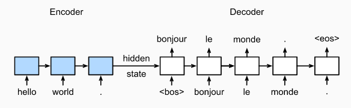

# English-Hindi Translation using Seq2Seq 
## Overview
  + Sequence-to-sequence models are widely used in natural language processing tasks such as machine translation, summarization, and chatbot development.
  + This project demonstrates the use of an encoder-decoder architecture with LSTM layers for translation tasks.
  
  + **Purpose:**
    * The primary goal of this project is to build an end-to-end pipeline for natural language translation using machine learning.

## Dataset 
  + The dataset taken is [IIT Bombay English-Hindi Translation Dataset](https://www.kaggle.com/datasets/vaibhavkumar11/hindi-english-parallel-corpus) from kaggle. Each line in the dataset corresponds to a pair of sentences in the two languages.

## Model architecture
  + The model have used the [Glove Alogrithm](https://www.kaggle.com/datasets/rtatman/glove-global-vectors-for-word-representation) for converting english words into word vectors.
  + Encoder:Takes a variable-length sequence as input and transforms it into a fixed-shape state.
  + Decoder:Maps the fixed-shape encoded state to a variable-length sequence. The decoder predicts an output at each step to generate the entire sentence.
  + Teacher Forcing have been used during Training  

## Model Evaluation 
  + The model have tested the the loss and accuracy with validation loss and accuracy metrics.
  + Accuracy Metrics
  
  + Loss Metrics
  
  + The model was tested on kaggle notebooks.

